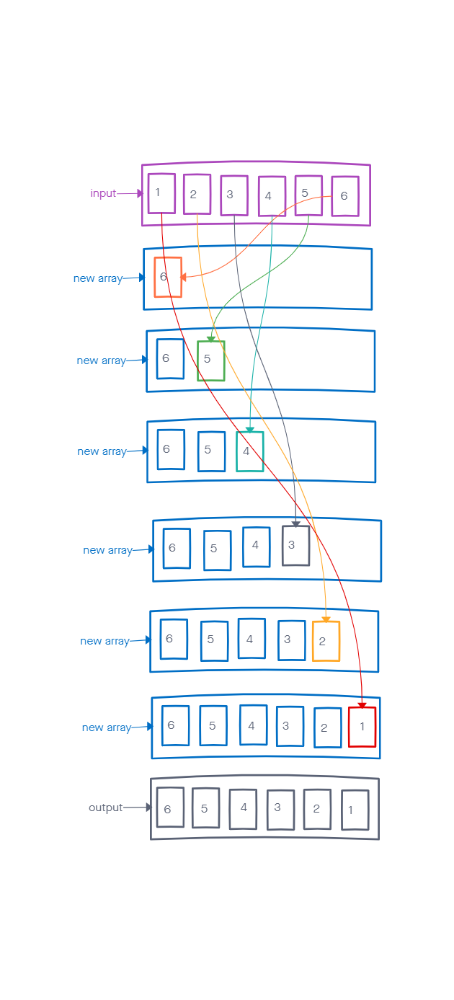

# Reverse Array

## Problem Domain

- Reverse an array without using `.reverse()`

## Array

- What is an Array?

  - an ordered list of values. Each value is called an element specified by an index.
  - can hold values of different types. For example, you can have an array that stores the number and string, and boolean values.
  
## Visual Diagrams

## Algorithm

- I need an empty array to hold the reverse elements

- I want to take the last element in the input array and add the element to the empty array

- I need to iterate over the input array to do this

- After the iteration is done I want to display output array

## JavaScript Implementation

- [Reverse Array](reverseArray.js)

## Big O Notation

- Time complexity: O(n)
- Space complexity: O(n)

## Testing

- [Testing reverse array function](/__tests__reverseArray.test.js)

## Supporting Resources

- [How to Reverse Arrays in JavaScript Without Using .reverse()](https://josephcardillo.medium.com/how-to-reverse-arrays-in-javascript-without-using-reverse-ae995904efbe)

- [JavaScript Arrays](https://www.javascripttutorial.net/javascript-array/)
