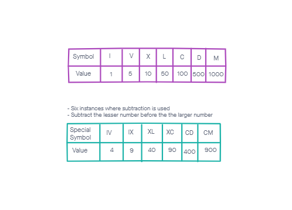
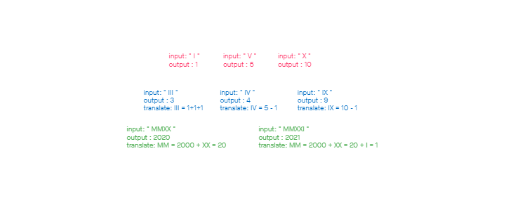

# Roman to Integer

## Problem Domain 
- Given a Roman number as a string, return the integer number that it corresponds to.

## Roman Numerals
1. What is a Roman Number?
    - Numbers are represented by combinations of letters from the Latin alphabet. 
    - There are seven symbols and each with a fixed integer value: 

      | Symbol 	| I 	| V 	| X  	| L  	| C   	| D   	| M    	|
      |:------:	|---	|---	|----	|----	|-----	|-----	|------	|
      |  Value 	| 1 	| 5 	| 10 	| 50 	| 100 	| 500 	| 1000 	|

    - The notations:
      - `IV` will translate to "one less than five" equal (4) 
      - `IX` will translate to "one less than ten" equal (9)
      - `XL` will translate to "ten less than fifty" equal (40)
      - `XC` will translate to "ten less than hundred" equal (90)
      - `CD` will translate to "hundred less than five hundred" equal (400)
      - `CM` will translate to "hundred less than thousand" equal (900)

## Visual Diagrams

## Algorithm
1. Need a variable for an object to place roman numeral strings with their values
2. Convert individual Roman numeral strings to an integer value
    - need a counter to total values
    - iterate over the object
      - need a current value variable
      - need a next value variable
      - compare if current value is less than next value 
        - subtract current value from next value
        - move 2 characters to the right
        - else add to total
    - return total
3. Print roman numeral strings
    - return integer

## JavaScript Implementation
- [Roman to Integer](/code-review/DSA/romanToInteger/romanToInteger.js)

## Big O Notation 
- Time Complexity = O(n), where n is the size of the given Roman string.
- Space Complexity = O(1)

## Testing
- [Roman Number to Integer Test Function](/code-review/__tests__/romanToIngeter.test.js)

## Supporting Resources 
- [Roman Numerals](https://en.wikipedia.org/wiki/Roman_numerals)
- [LeetCode #13 - Roman To Integer](https://redquark.org/leetcode/0013-roman-to-integer/)
- [Convert Roman Numerals to Integers in JavaScript](https://javascript.plainenglish.io/algorithms-101-convert-roman-numerals-to-integers-in-javascript-d3aba86a43d4)

